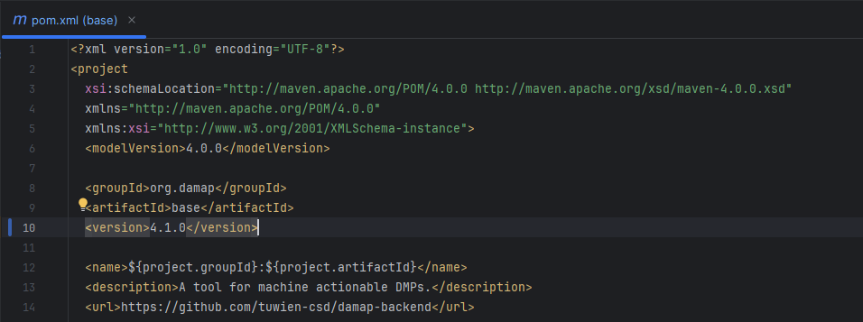
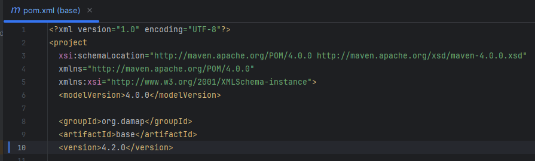
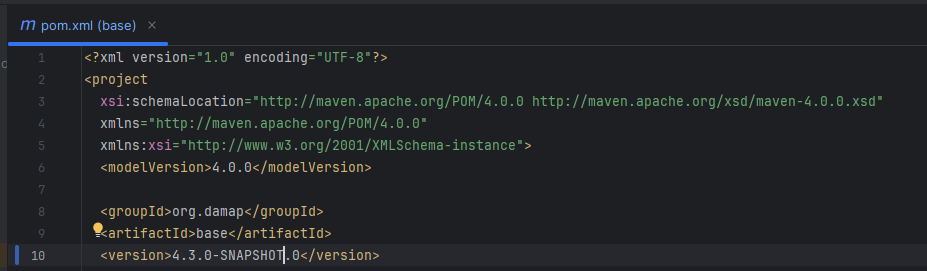
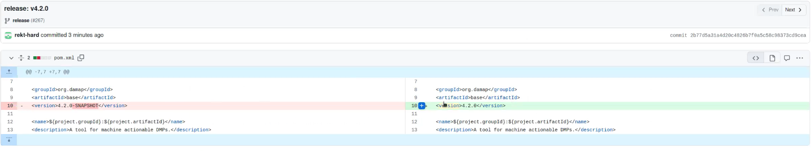
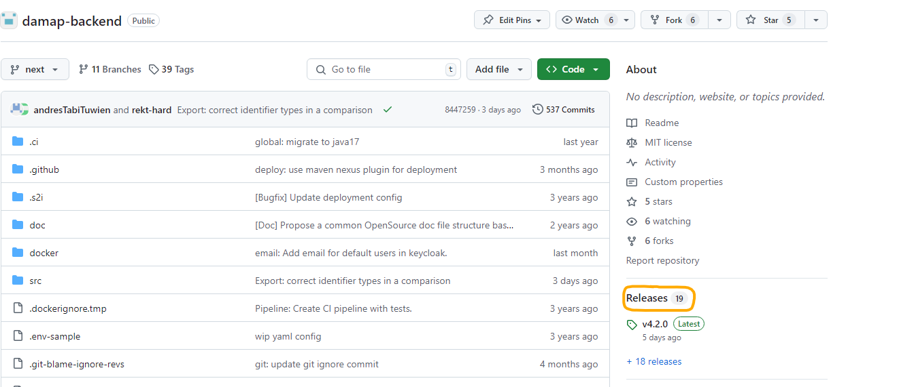
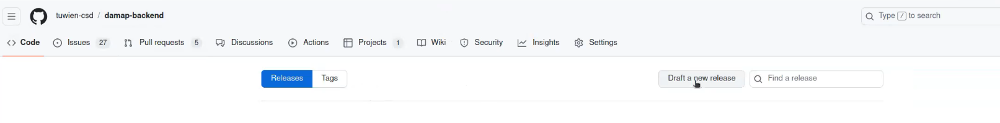
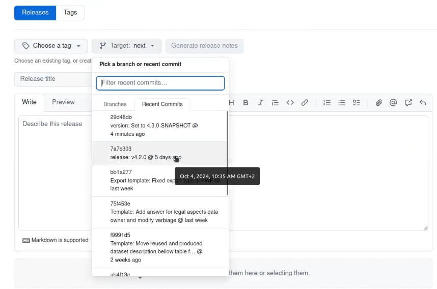
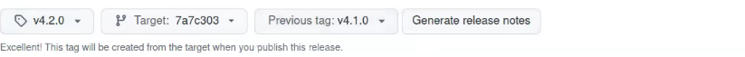
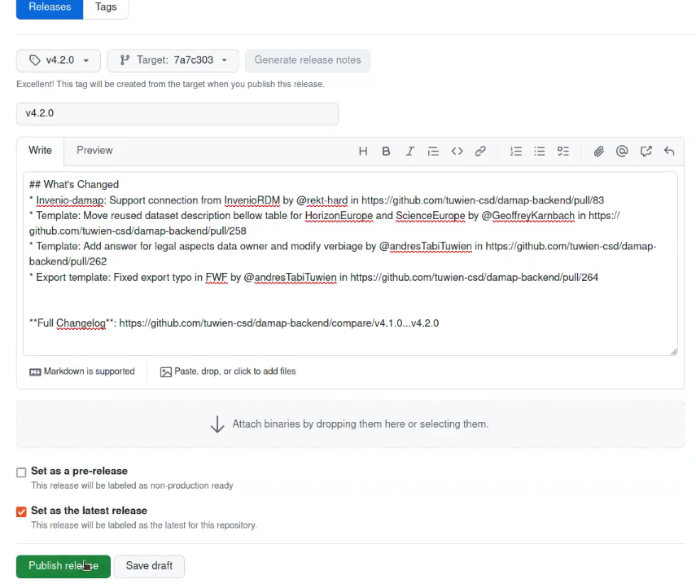

# Readme for making releases in DAMAP
For each realese, we create a pull request and with those changes, a tag can be created (either on the command line or directly through the GitHub UI). \
A tag should only be created once the pull request has been merged, as otherwise the release will not be complete. \

### Versioning strategy
As often used in software engineering, we use semantic versioning 2.0.0 (https://semver.org/) to determine the version number. \
A version number consists of three parts: major.minor.patch: \
- The patch number is increased for bug fixes or minor changes that do not affect the API. The main use case is when a bug is fixed and the deployment of the bugfix is time-critical / urgent. \
- The minor number is increased for new features that are backwards compatible. Changes are supposed to be implemented in a way that a custom implementation does not have to change anything. \
- The major number is increased for breaking changes. Those are changes that require a custom implementation to be updated. Examples are changes in the API or dependencies that need to be updated manually.
  Even unassumingly small changes can be breaking changes (such as changing the name of a variable in a frontend interface), so it is important to be careful when increasing the major version number.
  Ideally, breaking changes should be kept to a minimum and bundled together in one release.

For each subsequent release of the same type (major, minor, patch), the version number is increased by one. \
If we make a new release with a higher version number, we reset the lower version numbers to 0. (e.g. 1.2.3 -> 2.0.0, 1.2.3->1.3.0, 1.2.3->1.2.4) \

## Creating a release in the backend

In order to create a new backend release, we first need to create a new branch from the "next" branch. \
The branch should be named "release" (will anyway be deleted after the release). \
In the pom.xml file, we need to change the version number to the new version. \
 \
In this example, based on semantic versioning, we are releasing minor changes (and going from 4.1.0 to 4.2.0). \
 \
Once the version number has been changed, we need to commit the changes and create a second commit afterward, that will change the version number to a SNAPSHOT version. \
 \
(Note: The SNAPSHOT version is java specific and indicates that this is a development version. It is not recommended to use this version in production, as it may contain bugs or other issues.) \

We are now ready to push the changes to the repository and create a pull request. \
Since the pom.xml file is being changed in both commits, only the most recent will show up. To make sure that the changes are correct, we can check the commit history. \


### Create a tag using the Git CLI
After the pipeline run through and the pull request is approved, we can create a tag using the Git CLI. \
1. ```git log```
2. Copy the hash of the commit we want to tag
3. ```git tag v4.2.0 commitHash``` \
   (Note: The tag should be prefixed with a "v" and the commit hash should be the one we copied from the log)

### Create a tag from the GitHub UI
1. On the GitHub page, we go to the releases tab. \
   
2. We are now able to create a "Draft release" by clicking on the button. \
   
3. In the **Target** dropdown, we can select the commit for our new release. \
   
4. We can now create a new tag and generate the release notes. (Note: We should always prefix the tag with a "v") \
5. The release notes can be automatically generated using the previous version. \
   
6. We can finally publish the release by clicking on the "Publish release" button. \
   

The pipeline in the backend will now run through and deploy the new version to the Maven central repository. It may take a while for the Maven repository to become publicly available. \
To check if the public repository in Maven already has the new version, we can go to https://central.sonatype.com/ and search for org.damap and see what version is published there. As long as
the pipeline went through successfully, the version should be available there within a few hours. \

## Frontend Releases
The workflow for the frontend is similar to the backend. The main difference is that we do not need to use the SNAPSHOT version. \
1. We once again create a new release branch.
2. We change the version in package.json using the same semantic versioning strategy.
3. Run npm install.
4. After that we should check that the package-lock.json has the new version. The commit should be named as the new version.
5. Then we add to the commit the package.json, package-lock.json and push them.
6. We can now create a PR and merge it (once it has been approved).
   Note: For the frontend we do not need to do the SNAPSHOT strategy at the end.
7. We can now create a new release, similarly to the [backend](#create-a-tag-using-the-git-cli).
   


