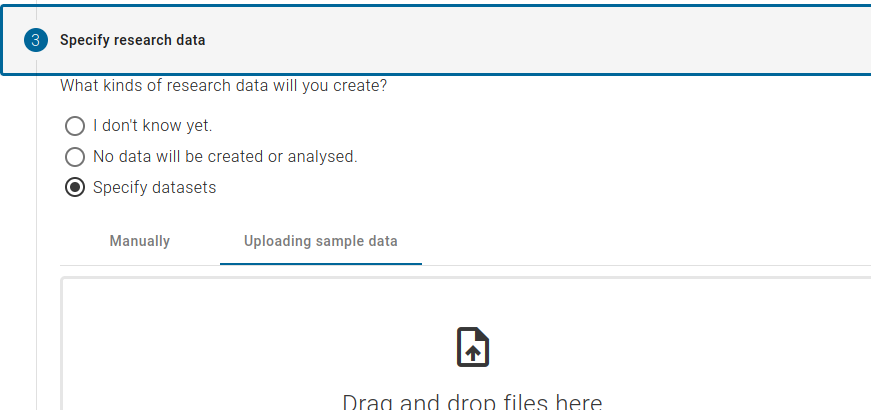
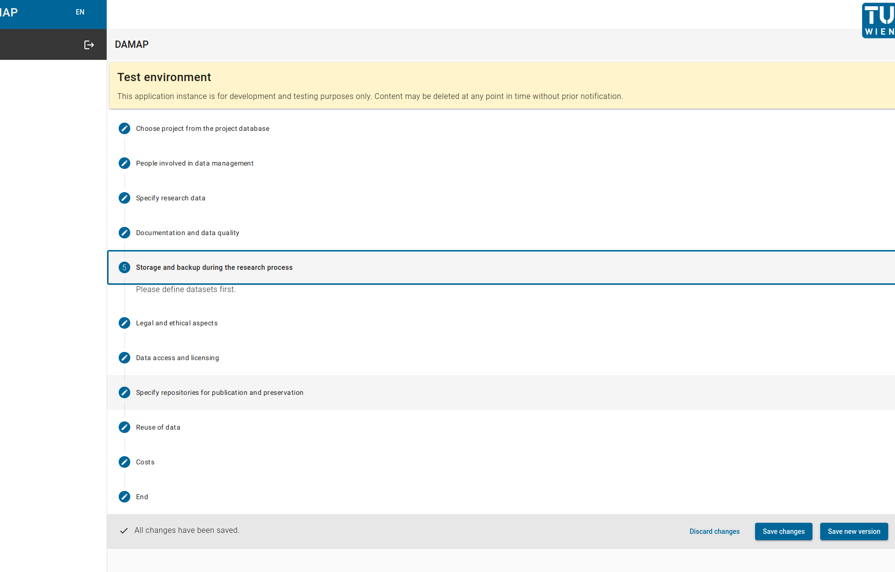
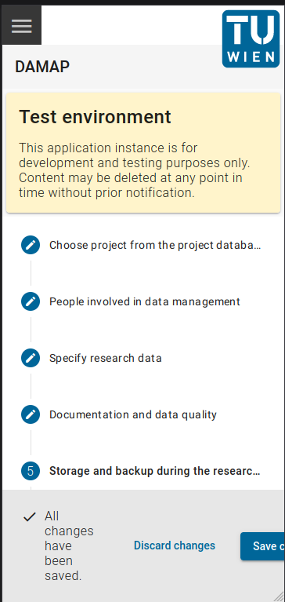

# DAMAP

DAMAP is a tool that is currently being developed by TU Wien and TU Graz as part of the 
[FAIR Data Austria](https://forschungsdaten.at/fda/) project. 
It is based on the idea of machine actionable data management plans (maDMPs) and aims to facilitate the 
creation of data management plans (DMPs) for researchers. 
The tool aims to be closely integrated into the institutional environment, collecting information from 
various established systems, in order to perceive project information, research data and personnel data 
from existing systems.
This saves DMP authors from having to enter the same data several times. 
Finally DAMAP delivers both a DMP that can be read and edited as a Word document, and an maDMP whose 
information can be used at machine level. The current content of DAMAP is based on 
[Science Europe’s Practical Guide to the International Alignment of Research Data Management](https://www.tuwien.at/fileadmin/Assets/forschung/Zentrum_Forschungsdatenmanagement/pdf-Sammlung/se_rdm_practical_guide_extended_final_2021.pdf)
and is compatible with the [RDA recommendation on machine actionable DMPs](https://zenodo.org/record/4036060#.Yk20vjWxVaR).

For a showcase of some of the tools functions see the [demo video](https://youtu.be/IxQzqy26ZO4).

## Components

DAMAP is a typical Three-Tier-Architecture project composed out of the database tier and the following two projects 
residing in separate source code repositories.

1. **[damap-backend](https://github.com/tuwien-csd/damap-backend):** maDMPs backend project
2. **[damap-frontend](https://github.com/tuwien-csd/damap-frontend):** maDMPs frontend project

Also there are some components that you should already have at your institution that you can integrate with damap,
in order to make this tool your own:

1. Authentication service with OpenID support (e.g. [Keycloak](https://www.keycloak.org/))
2. [CRIS](https://en.wikipedia.org/wiki/Current_research_information_system) system (system managing research projects)
3. System managing researcher data

Additionally you may choose to run and integrate a [FITS](https://projects.iq.harvard.edu/fits) implementation,
in order to provide file format recognition to the application.

The actively supported database is [Postgres](https://www.postgresql.org/). Other databases could be used as well,
but they may not be tested.

## Documentation

Once documentation is ready, it will be available from this repository in the `doc` folder at 
[Documentation](doc/index.md).

## Installation

DAMAP can be installed in several ways, but since it is composed out of multiple different applications, running DAMAP
as containers seems to be the most straight forward way. You can find detailed installation instructions in the 
[INSTALLATION.md](INSTALLATION.md) file.

## Customisation

To make use of the powers of DAMAP, customisations should be added to integrate it in your system environment.
[CUSTOMISING.md](CUSTOMISING.md) documents the steps needed in order to adapt DAMAP to your needs.

## Contributing

Before contributing code, please carefully read the contribution guidelines in the [CONTRIBUTING.md](CONTRIBUTING.md) 
file.

## Authors

* [Zeno Casellato](https://github.com/ZenoLC)
* [Clara Schuster](https://github.com/clarascu)
* [Hardani Maulana](https://github.com/hardanimaulana)
* [Florin Hillebrand](https://github.com/flozzone)
* [Luca Maestri](https://github.com/casualtimer)
* [David Eckhard](https://github.com/rekt-hard)
* [Laura Thaci](https://github.com/lpandath)

## License

The project is licensed under the MIT license. See [LICENSE](LICENSE) file for further information.

## Screenshots

||||
|:---:|:---:|:---:|
